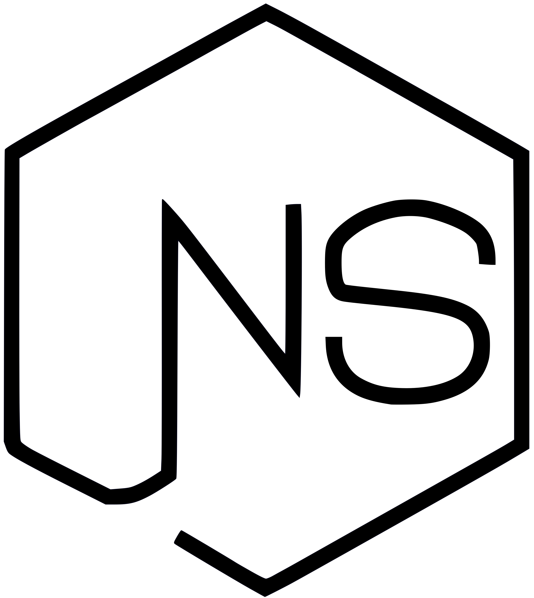

<h1 align="center">NodeShop - Uma loja online inspirada no design do Node.js, criada com Node.js (Express.js)</h1>
<p align="center">
  
  <br>
  <i>Esta aplicação é a parte backend do aplicativo NodeShop REST API, construída com 
    <br>Node.js (Express.js), apoiada por uma solução de banco de dados noSQL (MongoDB) e hospedada no Heroku.</i>
  <br>
</p>

<p align="center">
  <a href="https://nothingnothings.github.io/NodeShopRestAPI"><strong>https://nothingnothings.github.io/NodeShopRestAPI</strong></a>
  <br>
</p>


## Introdução

Este é o backend do ["NodeShop"](https://github.com/nothingnothings/NodeShopRestAPI), projeto frontend Single Page Application (SPA) construído com a biblioteca ReactJS (create-react-app).

Este aplicativo, como sugerido por seu nome, foi criado usando Node.js e o framework Express.js, e seu conteúdo foi hospedado na plataforma Heroku, conectada ao GitHub. Este aplicativo também está disponível como um aplicativo "multi-página", sem ReactJS e sem um backend REST API. O projeto multi-página pode ser encontrado [aqui](https://github.com/nothingnothings/NodeShopMultiPageApp).


[](http://hits.dwyl.com/nothingnothings/NodeShopRestAPIBackend)


 
## Tecnologias
 
Algumas das linguagens, pacotes e bibliotecas empregadas neste backend:
 
 - Node
 - Express.js (framework middleware-based para Node.js; foi usado para ter uma melhor configuração de endpoints do backend)
 - Node Package Manager (para inicialização e gerenciamento do aplicativo backend Node)
 - MongoDB (solução de armazenamento de banco de dados noSQL; armazenamento de objetos `user`, `product` e `order` em coleções em um banco de dados remoto MongoDB Atlas)
 - Stripe (integração fictícia da plataforma de pagamento Stripe com o aplicativo, para o manuseio de "pedidos" feitos pelo usuário)
 - `body-parser` (necessário para a análise dos dados JSON enviados pelo frontend)
 - `bcryptjs` (usado para armazenar senhas criptografadas dentro de documentos `user` no banco de dados MongoDB)
 - `multer` (usado para receber arquivos de imagem de produtos, no endpoint "Adicionar um Produto" - desativado nesta versão de demonstração do aplicativo)
 - `jsonwebtoken` (para a geração de JSON Web Tokens, que são então armazenados no armazenamento local do navegador do usuário e verificados para autenticação)
 - `pdfkit` (geração de documentos pdf para cada `order` produzida por um usuário)
 - `express-validator` (validação de dados de input do usuário, no backend, com métodos como `isEmpty()` e `isLength()`)
 
 
## Estrutura de Diretórios do Projeto

A estrutura de diretórios do backend, deste projeto:


```
.\
│
├── config\
│   ├── keys.js
│   └── prod.js
│
├── controllers\
│   ├── admin.js
│   ├── auth.js
│   └── shop.js
│
├── faturas\
│   ├── fatura-62e04d5c7ae0d991d83b1323.pdf
│   ├── fatura-62e18ad75511c94e87929855.pdf
│   ├── fatura-62e1a06e5511c94e87929fa4.pdf
│   ├── fatura-62eb1fa9e4c7306961ced46b.pdf
│   ├── fatura-62fc5a5c928dcb70525b5e11.pdf
│   └── fatura-62fc5a897fbf69bdbe21af55.pdf
│
├── images\
│   ├── 1658431838529-Bike.png
│   ├── 1658432590831-Boat.png
│   ├── 1658433107407-Pencil.png
│   ├── 1658433305838-Skateboard.png
│   ├── 1658433495040-keyboard.png
│   ├── 1658434189280-A set of tires.png
│   ├── 1658434649972-Boomerang.png
│   ├── 1658435067043-Drums.png
│   ├── 1658435608982-Violin.png
│   └── NodeShopBlack.png
│
├── middleware\
│   └── is-auth.js
│
├── models\
│   ├── order.js
│   ├── product.js
│   └── user.js
│
├── public\
│
├── routes\
│   ├── admin.js
│   ├── auth.js
│   └── shop.js
│
├── util\
│   └── path.js
│
├── README.md
├── app.js
├── package-lock.json
└── package.json
```


## Arquivo de Configuração do Projeto (package.json)

O arquivo package.json usado no projeto:

```
{
  "name": "nodejs-restapi",
  "version": "1.0.0",
  "description": "",
  "main": "index.js",
  "scripts": {
    "test": "echo \"Error: no test specified\" && exit 1",
    "start": "node app.js"
  },
  "author": "",
  "license": "ISC",
  "dependencies": {
    "bcryptjs": "^2.4.3",
    "body-parser": "^1.19.0",
    "express": "^4.17.1",
    "express-validator": "^6.14.2",
    "jsonwebtoken": "^8.5.1",
    "mongodb": "^4.8.1",
    "mongoose": "^6.5.1",
    "multer": "^1.4.5-lts.1",
    "pdfkit": "^0.13.0",
    "stripe": "^10.0.0",
    "uuid": "^8.3.2"
  }
}

```

## Configuração


Para usar este projeto, clone-o usando o Git:

1. Execute `git clone` para clonar o projeto em seu repositório local Git.
2. Execute `npm install` para instalar todas as dependências (`express`, `bcryptjs`, `mongodb`, etc).
3. Execute `npm start` para iniciar o aplicativo.
4. Use o servidor localmente ou realize o deploy na web, com a ajuda de um provedor de hospedagem (por exemplo, Heroku).
5. Para fins desta demonstração, na página "Get Started" (Autenticação), insira as credenciais `exemplo@exemplo.com` (email) e `exemplo` (senha) para acessar os vários recursos do aplicativo.


## Destaques

- Conectado a um Single-Page App (sem recarregamentos de página, REST API); é servido um único arquivo HTML (arquivo index.html, "esqueleto" para os componentes ReactJS)
- Para fins de demonstração de deploy, apenas um único usuário é habilitado/criado no lado do servidor, com as credenciais `exemplo@exemplo.com` (campo de email) e `exemplo` (campo de senha). A criação de usuários adicionais ("Sem conta? Junte-se ao NodeShop") é possível no aplicativo completo (neste aplicativo de demonstração, os endpoints de criação de conta estão desativados). Além disso, as "Orders" feitas pelo usuário são redefinidas a cada 60 minutos (recurso Time to Live Index, do MongoDB), e os produtos adicionados ao "Cart", a cada 8 horas (recurso de "Scheduled Trigger" do MongoDB)
- Lógica de validação de form input no serverside, auxiliada pelo pacote `express-validator`
- Lógica simples de paginação para a lista de produtos
- O backend utiliza e gerencia os objetos "User", "Product", "Order" e "Cart", que são armazenados em um banco de dados MongoDB (serviço MongoDB Atlas); o servidor Node.js e o banco de dados MongoDB também lidam com a lógica de autenticação (login/cadastro) implementada no aplicativo
- Representação fictícia da possível integração de aplicativos de loja com Stripe, com o pacote `react-stripe-checkout` e a lógica correspondente do lado do servidor produzindo efeitos no frontend (redirecionamento de página e atualização visual da página de "pedidos")
- Visualização das faturas de cada pedido em arquivos .pdf, produzidos pelo backend (pacote `pdfkit`)
- Uso de variáveis de ambiente com Heroku para ocultar informações sensíveis (API_KEYS, segredos de Json Web Token, nomes de usuário e senhas de banco de dados, etc.)


## Inspiration

Este aplicativo foi baseado nas aplicações vistas no curso "NodeJS - The Complete Guide (MVC, REST APIs, GraphQL, Deno)" de Maximilian Schwarzmüller.

